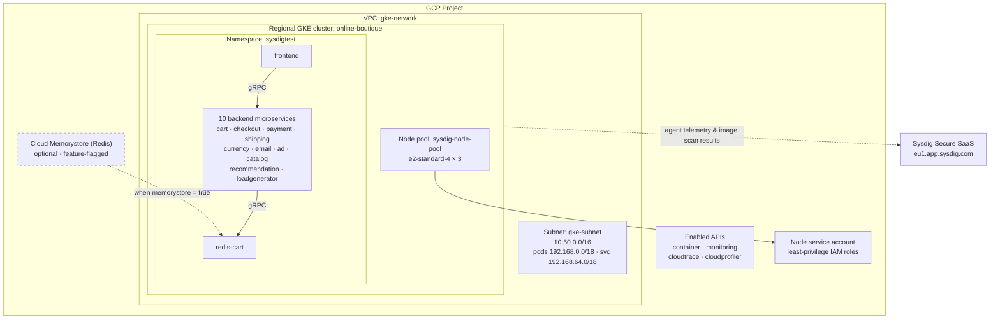
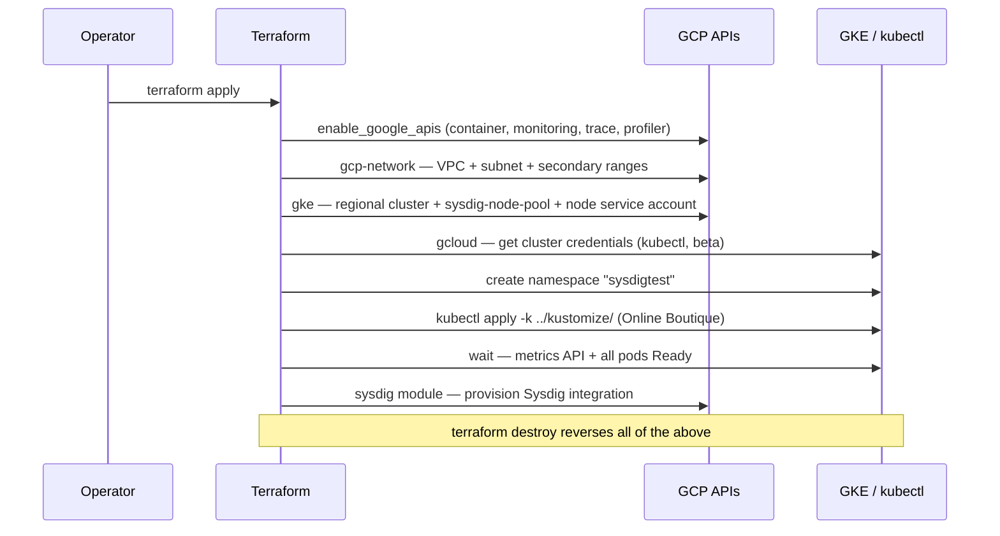

# Architecture

The proof of concept has three moving parts: the **GKE cluster and its network**, the **Terraform flow** that provisions everything, and the **Sysdig integration** that secures and observes the running workload. All three are described below, grounded in the actual resources in [`terraform/`](https://github.com/yassineteimi/gke-sysdig-poc/tree/main/terraform).

## System overview

The frontend serves an e-commerce UI; backend services communicate over gRPC; the cart state lives in an in-cluster `redis-cart` by default, or in Cloud Memorystore when the `memorystore` flag is enabled.

## Terraform provisioning flow

A single `terraform apply` executes the following ordered flow. Module sources are the official `terraform-google-modules` collection.

Key resources, by file:

| File | Responsibility |
| --- | --- |
| [`main.tf`](https://github.com/yassineteimi/gke-sysdig-poc/blob/main/terraform/main.tf) | API enablement, VPC/subnet, regional GKE cluster + node pool, credential fetch, namespace, Kustomize apply, readiness wait |
| [`memorystore.tf`](https://github.com/yassineteimi/gke-sysdig-poc/blob/main/terraform/memorystore.tf) | Optional Cloud Memorystore (Redis) instance, gated by `var.memorystore` |
| [`providers.tf`](https://github.com/yassineteimi/gke-sysdig-poc/blob/main/terraform/providers.tf) | `google`, `google-beta`, `kubernetes`, and `sysdig` providers |
| [`variables.tf`](https://github.com/yassineteimi/gke-sysdig-poc/blob/main/terraform/variables.tf) | Inputs: `project_id`, `region`, `cluster_name`, `namespace`, `memorystore`, `sysdig_secure_api_token`, … |
| [`output.tf`](https://github.com/yassineteimi/gke-sysdig-poc/blob/main/terraform/output.tf) | Cluster endpoint, CA certificate, node service account, network outputs (sensitive values flagged) |

## Networking model

- **Custom VPC** `gke-network` with a single regional subnet `gke-subnet` (`10.50.0.0/16`).
- **VPC-native (alias IP) cluster** using two secondary ranges — `192.168.0.0/18` for Pods and `192.168.64.0/18` for Services — so Pod and Service addressing is routed natively in the VPC rather than overlaid.
- **Regional control plane and nodes** for resilience across zones within the region.

## Sysdig integration

Sysdig is wired in through the **Sysdig Terraform module** alongside the `sysdig` provider (pointed at the `eu1` Sysdig Secure SaaS region). Once provisioned, Sysdig delivers two capabilities against the `sysdigtest` namespace:

1. **Runtime threat detection** — the in-cluster Sysdig components stream syscall-level activity to Sysdig Secure for policy evaluation and detection.
2. **Image vulnerability scanning** — workload images are scanned and the results are queryable through the Sysdig Secure scanning API; the helper script [`sysdig_api/scanning_api.sh`](https://github.com/yassineteimi/gke-sysdig-poc/blob/main/sysdig_api/scanning_api.sh) pulls per-namespace and per-workload CVE summaries.

See **[Security & Observability](security.md)** for how IAM, network policy, and these two Sysdig capabilities combine into the overall posture.
